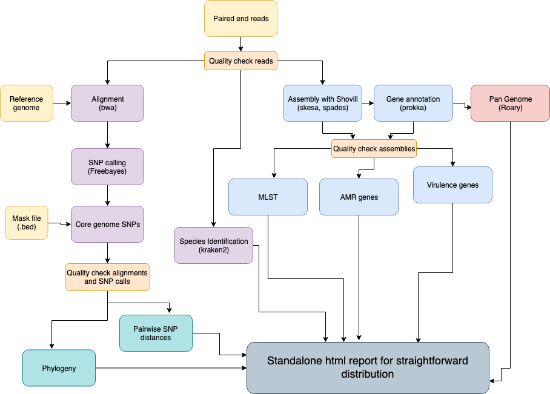

[](https://github.com/MDU-PHL/bohra/actions/workflows/CI.yml)
[](https://github.com/MDU-PHL/bohra/releases/latest)
[](https://anaconda.org/bioconda/bohra)

[](https://www.gnu.org/licenses/gpl-3.0)

# Bohra


Bohra is an extensive pipeline 
for taking genome sequences
(short reads or assemblies) 
and running common bioinformatics assays
across the, including
[genotyping, AMR detection, and phylogenetics](https://github.com/MDU-PHL/bohra#workflow).

Bohra is a modern replacement for the 
[Nullarbor](https://github.com/tseemann/nullarbor)
pipeline. It is written in Python and Nextflow
instead of Perl and Make.

# Installation

1. Install the base packaghe
```
% conda create -n bohra -c bioconda bohra
% borha --version
```
2. Install all the analysis modules.
This can take a long time (10-60 min) but it's worth it!
```
% bohra deps install
```
3. Test everthing worked ok
```
% bohra test --cpus 8 
```

# Documentation

Read the [Bohra website](https://mdu-phl.github.io/bohra/)
to learn how to use all the availaile features.

# Workflow



# Authors

* [Kristy Horna](https://github.com/kristyhoran)
* [Torsten Seemann](https://tseemann.github.io)
