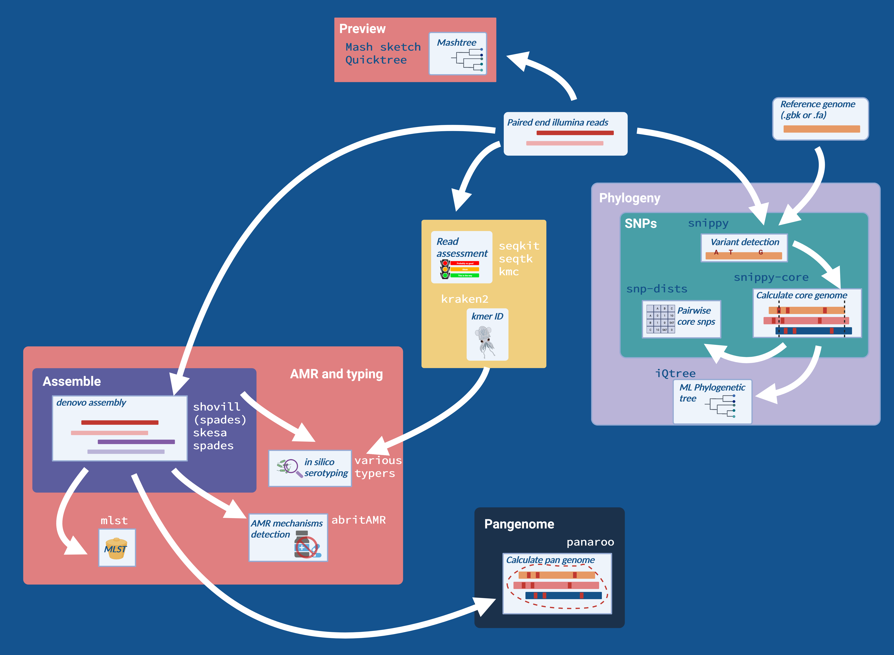

[](https://github.com/MDU-PHL/bohra/actions/workflows/CI.yml)
[](https://github.com/MDU-PHL/bohra/releases/latest)
[](https://anaconda.org/bioconda/bohra)

[](https://www.gnu.org/licenses/gpl-3.0)

# Bohra


Bohra is am extensive pipeline 
for taking genome sequences
(short reads or assemblies) 
and running common bioinformatics assays
across the, including
[genotyping, AMR detection, and phylogenetics](#workflow).

# Install
```
% conda create -n bohra -c bioconda bohra
% bohra deps install
% bohra --version
```

# Documentation

Read the [Bohra website](https://mdu-phl.github.io/bohra/)
to learn how to use all the availaile features.

# Workflow

<P></P>

# Authors

* [Kristy Horna](https://github.com/kristyhoran)
* [Torsten Seemann](https://tseemann.github.io)
