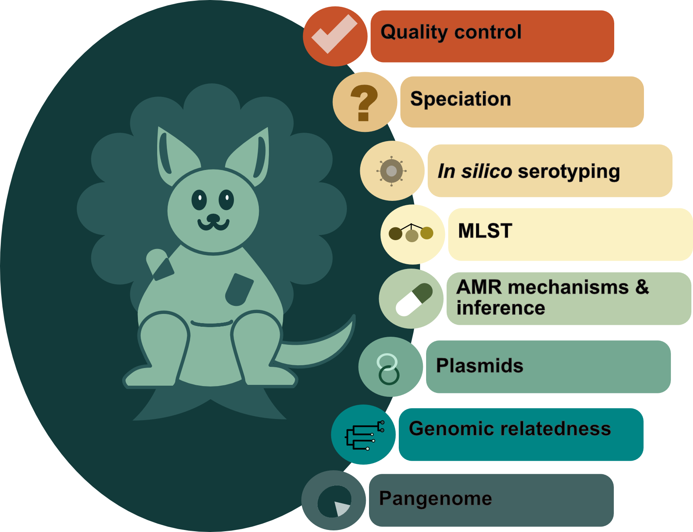
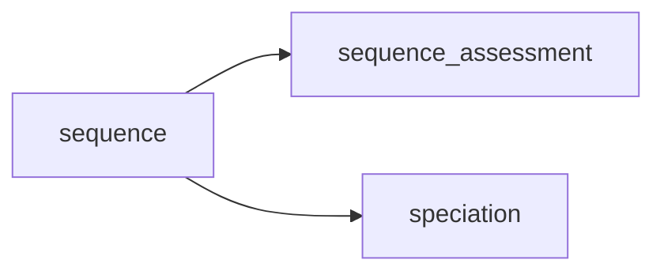

# The home of bohra

**Comprehensive sequence characterisation for microbial genomics**

## Introduction

`bohra` is microbial genomics pipeline, designed predominantly for use in public health, but may also be useful in research settings. It leverages existing high quality bioinformatics tools, to provide users with an easily accessible report of comprehensive analysis results of bacterial sequence data to for characterisation of single samples or for outbreak investigations or population studies. 

1. Quality assessment of the input data
2. Speciation and appropriate _in silico_ serotyping (where applicable).
3. MLST
4. Species relevant recovery of AMR mechanisms and inference of genomic AST/DST were available (_S. enterica_ and _M. tuberulosis_).
5. Plasmid information
6. Comparative analysis using a reference-free or reference-based appproaches.
7. Pangenome analysis.

The pipeline is designed to be flexible and modular, allowing for inputs from paired end fastq or assemblies, with direct support for ONT coming soon.

Stand alone html reports are generated for easy sharing and visualisation of the results.

### Workflow

**basic**

This workflow is the first step in all other workflows implmented by `bohra`. It can also be used alone as a simply quality control workflow.

### Etymology

The name 'bohra', is the name of an exinct species of tree kangaroo that lived on the Nullarbor plain in Australia was chosen to reflect the fact that it was originally developed to used to build trees, relies on [snippy](https://github.com/tseemann/snippy) (named for a very famous kangaroo) and was inspired by [nullarbor](https://github.com/tseemann/nullarbor).
