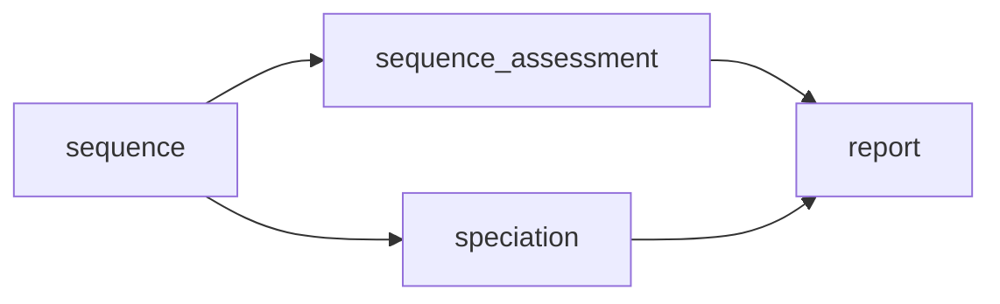
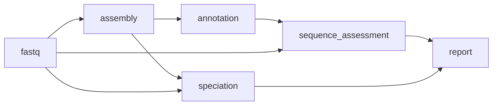
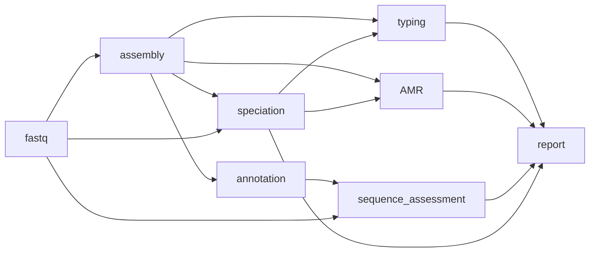
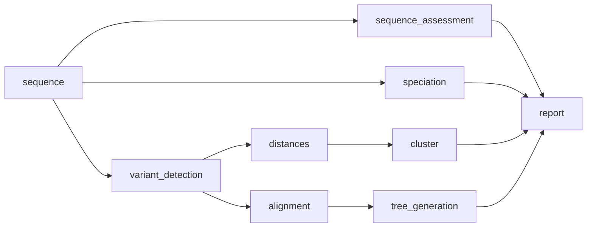
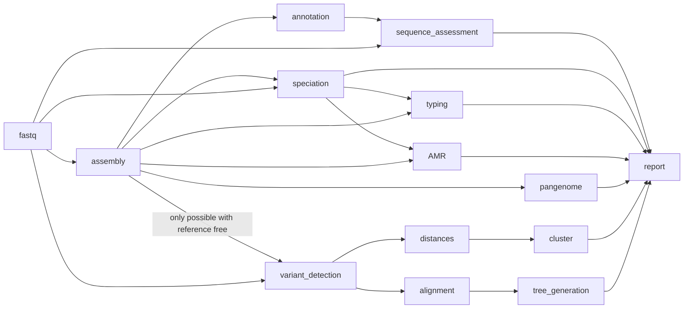
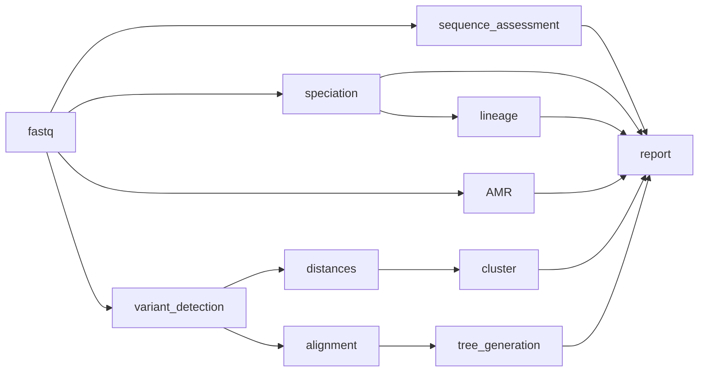

# The home of bohra


**Comprehensive sequence characterisation for microbial genomics**

## Introduction

`bohra` is microbial genomics pipeline, designed predominantly for use in public health, but may also be useful in research settings. It leverages existing high quality bioinformatics tools, to provide users with an easily accessible report of comprehensive analysis results of bacterial sequence data to for characterisation of single samples or for outbreak investigations or population studies. 

1. Quality assessment of the input data
2. Speciation and appropriate _in silico_ serotyping (where applicable).
3. MLST
4. Species relevant recovery of AMR mechanisms and inference of genomic AST/DST were available (_S. enterica_ and _M. tuberulosis_).
5. Plasmid information
6. Comparative analysis using a reference-free or reference-based appproaches.
7. Pangenome analysis.


The pipeline is designed to be flexible and modular, allowing for inputs from paired end fastq or assemblies, with direct support for ONT coming soon.

Stand alone html reports are generated for easy sharing and visualisation of the results.

# Installation

**Note the following instructions are for pre-release installation for `bohra` version 3**

`bohra` is a large pipeline with many dependencies, including databases required for speciation. Currently `bohra` is only available for installation with `conda`.

## Create the environment

### 1. Install conda (skip this step if you already have conda installed)

If you do not already have `conda` installed, you can check out the documentation [here](https://docs.conda.io/projects/conda/en/stable/user-guide/install/index.html). We recommend you install [`miniforge`](https://github.com/conda-forge/miniforge)


### 2. Setup the `bohra` environment and install the pipeline co-ordinator

1. Clone the `bohra` repository

```
git clone git@github.com:MDU-PHL/bohra.git
```


2. Create the environment 


```
cd bohra
conda env create -f environment.yml -n bohra
```

3. Install the `bohra` co-ordinator


```
pip3 install /path/to/the/repository_for/bohra
```

4. Test this has worked as expected
```
bohra --help
```
Should result in 

```
Usage: bohra [OPTIONS] COMMAND [ARGS]...

Options:
  --version  Show the version and exit.
  --help     Show this message and exit.

Commands:
  check           Check that dependencies are installed correctly.
  generate-input  Generare input files for the Bohra pipeline.
  install-deps    Install dependencies for Bohra - Highly recommended to...
  run             Run the Bohra pipeline.
  test            Check that bohra is installed correctly
```

### 3. Install dependencies and setup environment variables

It is highly recommended that you allow `bohra` to setup the required dependencies for the pipeline. 

This step will setup conda environments in your `~/.conda` or `~/.miniconda3` (depending on how you have configured your `conda` installation). These environments will be prefixed with the name of the environment that you have installed `bohra` into. For example if you used the `environment.yml` file in step 2 your prefix will be `bohra-3pr`. This will ensure consistency and prevent duplication of environments across a file system. 

This is also useful for public health users, were the versions of software and databases needs to be strictly controlled.

Additionally, `bohra` depends upon either a correctly configure `kraken2` compatible database OR a `sylph` compatible database. The `bohra install-deps` command will optionally download the databases for your and also set the appropriate environment variables for you.

1. Activate your environment from step 2 above
```
conda activate bohra-3pr
```

2. Run the bohra dependency installation

```
bohra install-deps
```

The initial creation of the conda environments may take some time. Once the environments are set up, `bohra` will try to set up your database environment variables. Although this is not essential it is HIGHLY recommended for ease of running and reproducibility. 

Please be aware of the following:

* If you elect to say no to setting up a `BOHRA_KRAKEN2_DB` or `BOHRA_SYLPH_DB`, you will need to provide EITHER the `--kraken2_db` OR a `--sylph_db` flag each time you run `bohra` if you wish to do speciation or use any features which depend on species (typing and AMR).

* If you are happy to use the `mlst` database that comes bundled with the `mlst` [tool](https://github.com/tseemann/mlst), then you can decline setting the `BOHRA_PUBMLST_DB` and `BOHRA_BLAST_DB`.

* If you are working in your own environments (`~/.conda` or `~/.miniconda`) you skip setting the `BOHRA_MOBSUITE_DB` environment variable. However, please note if you are setting up `bohra` in a share environment, you may run into permissions issues if `mobsuite` database requires updating at the time of running (this can happen) - so please ensure that you have a properly set up `mob_suite` database and provide this path when requested during set up.

* If you already have a kraken2 database and/or a sylph database you can press 'n' when asked if you want to download. If you select 'y' please make sure that you have enough storage space for the databases. Some are quite large, up to 600 GB (half-terabyte).


## Workflows

`bohra` is a flexible pipeline and allows users to customise the workflows used. Below is an overview of each workflow. More detail on tools and options for each workflow can be found [here](usage/running_bohra.md) and [here](usage/modules.md). Further explanations and detailed guides can be found [here](guides/overview.md)

**basic**

This workflow will run on fastq and/or fasta (depending user supplied input) and is the first step in all other workflows implmented by `bohra`. It can also be used alone as a simply quality control workflow.


**assembly**

This workflow will simple generate assemblies from paired-end fastq, run basic genome annotation with `prokka` and assess the quality of both the input reads and the resulting assemblies. This workflow forms the basis for amr, typing and pangenome analysis.



**amr and typing**

This workflow will use user supplied species or the species detected in the sequence to determine the appropriate typing and AMR pipeline to use. Additional inferrence of genomic DST/AST will be undertaken for _S. enterica_ and _M. tuberculosis_.

If assembly is required and fastq are used as input - the assembly workflow will be triggered. 

Note that for AMR and gDST in _M. tuberculosis_ paired-end fastq are required. We recommend to use the `bohra run tb` workflow for _M. tuberculosis_.



**comparative analysis**

This workflow undertakes a comparative anaysis of all the sequences included in the analysis. You can use reference based alignments with `snippy` or you can use reference free approaches with `mash` and `ska2`. 



**full**

The full workflow includes all the workflows outlined above with the addition of pangenome analysis using `panaroo`.



**tb**

`bohra` now has a _M. tuberulosis_ specific workflow, which does not run MLST or other assembly based tools. And undertakes _M. tuberculosis_ relevant gDST. It uses the H37rV reference genome, masking repetitive sites and `tbtAMR` for generation of an inferred antibiogram.


## Etymology

The name 'bohra', is the name of an exinct species of tree kangaroo that lived on the Nullarbor plain in Australia was chosen to reflect the fact that it was originally developed to used to build trees, relies on [snippy](https://github.com/tseemann/snippy) (named for a very famous kangaroo) and was inspired by [nullarbor](https://github.com/tseemann/nullarbor).
