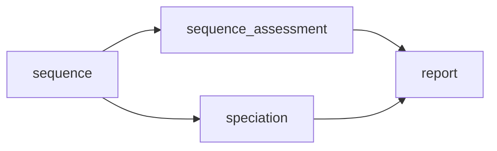
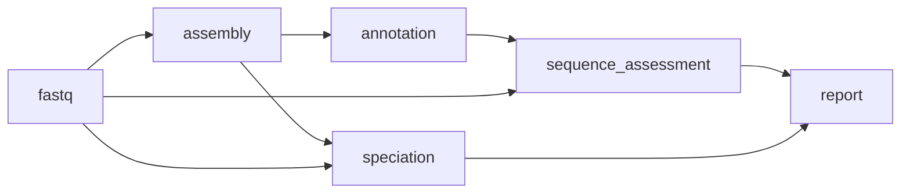
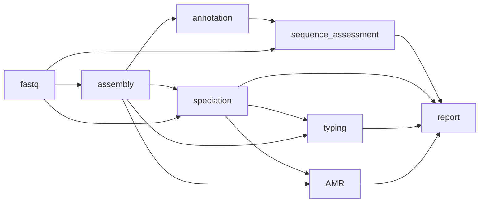
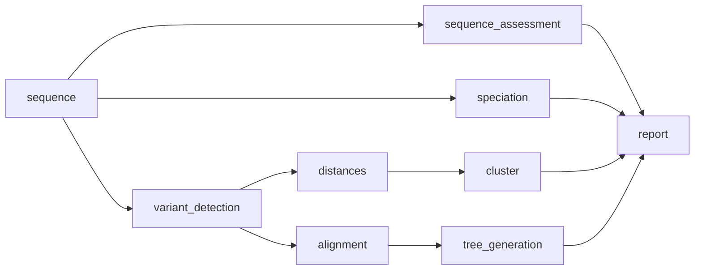
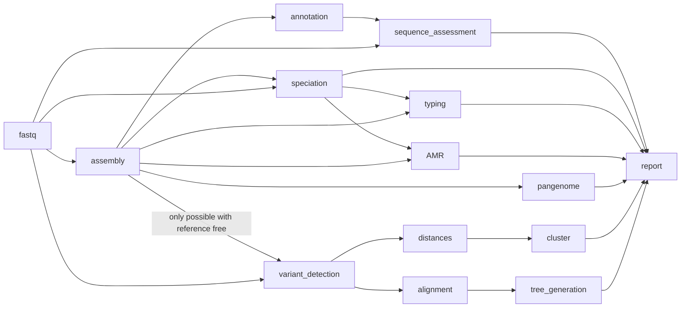

# The home of bohra

**Comprehensive sequence characterisation for microbial genomics**

## Introduction

`bohra` is microbial genomics pipeline, designed predominantly for use in public health, but may also be useful in research settings. It leverages existing high quality bioinformatics tools, to provide users with an easily accessible report of comprehensive analysis results of bacterial sequence data to for characterisation of single samples or for outbreak investigations or population studies. 

1. Quality assessment of the input data
2. Speciation and appropriate _in silico_ serotyping (where applicable).
3. MLST
4. Species relevant recovery of AMR mechanisms and inference of genomic AST/DST were available (_S. enterica_ and _M. tuberulosis_).
5. Plasmid information
6. Comparative analysis using a reference-free or reference-based appproaches.
7. Pangenome analysis.

The pipeline is designed to be flexible and modular, allowing for inputs from paired end fastq or assemblies, with direct support for ONT coming soon.

Stand alone html reports are generated for easy sharing and visualisation of the results.

## Workflows

`bohra` is a flexible pipeline and allows users to customise the workflows used. Below is an overview of each workflow. More detail on tools and options for each workflow can be found [here](usage/modules.md). Further explanations and detailed guides can be found [here](guides/overview.md)

**basic**

This workflow will run on fastq and/or fasta (depending user supplied input) and is the first step in all other workflows implmented by `bohra`. It can also be used alone as a simply quality control workflow.

**assembly**

This workflow will simple generate assemblies from paired-end fastq, run basic genome annotation with `prokka` and assess the quality of both the input reads and the resulting assemblies. This workflow forms the basis for amr, typing and pangenome analysis.

**amr and typing**

This workflow will use user supplied species or the species detected in the sequence to determine the appropriate typing and AMR pipeline to use. Additional inferrence of genomic DST/AST will be undertaken for _S. enterica_ and _M. tuberculosis_.

If assembly is required and fastq are used as input - the assembly workflow will be triggered. 

Note that for AMR and gDST in _M. tuberculosis_ paired-end fastq are required. We recommend to use the `bohra run tb` workflow for _M. tuberculosis_.

**comparative analysis**

This workflow undertakes a comparative anaysis of all the sequences included in the analysis. You can use reference based alignments with `snippy` or you can use reference free approaches with `mash` and `ska2`. 

**full**

The full workflow includes all the workflows outlined above with the addition of pangenome analysis using `panaroo`.

## Etymology

The name 'bohra', is the name of an exinct species of tree kangaroo that lived on the Nullarbor plain in Australia was chosen to reflect the fact that it was originally developed to used to build trees, relies on [snippy](https://github.com/tseemann/snippy) (named for a very famous kangaroo) and was inspired by [nullarbor](https://github.com/tseemann/nullarbor).
