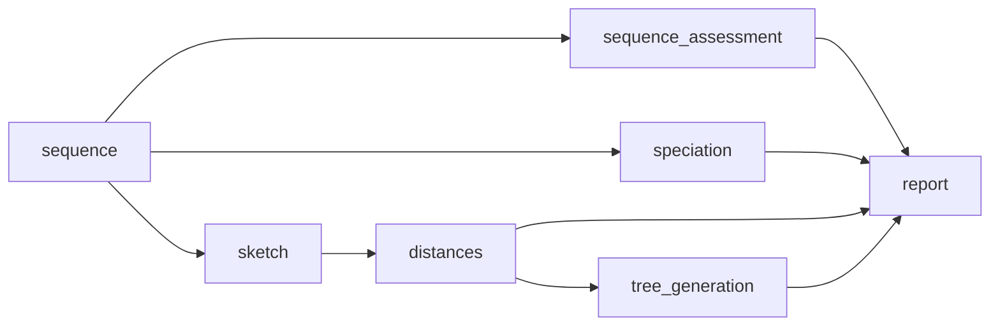

# comparative pipeline

This workflow will run on fastq and/or fasta (depending user supplied input) and is the first step in all other workflows implmented by `bohra`. It can also be used alone as a simply quality control workflow.



 Please take note - it will not run any assembly based tools, like MLST or AMR. If these are required use the `full` pipeline. There are three tools available in `bohra` that can be used for this purpose


```
bohra run preview -i input_file.tsv -j my_preview_pipeline
```