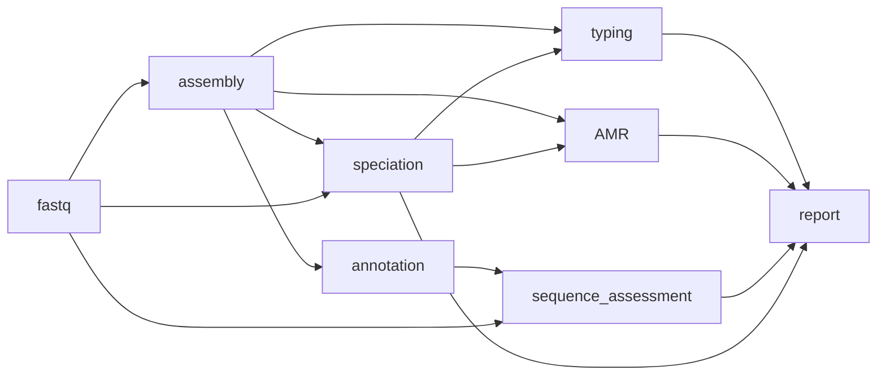

# amr_typing pipeline


This workflow will use user supplied species or the species detected in the sequence to determine the appropriate typing and AMR pipeline to use. Additional inferrence of genomic DST/AST will be undertaken for _S. enterica_ and _M. tuberculosis_.

If assembly is required and fastq are used as input - the assembly workflow will be triggered. 

Note that for AMR and gDST in _M. tuberculosis_ paired-end fastq are required. We recommend to use the `bohra run tb` workflow for _M. tuberculosis_.




This pipeline will use `abritamr` for AMR mechanism detection and undertake species appropriate serotyping. Please note that if you do not supply a species and set `--speciation none` there will be no species specific AMR or serotyping done.
You can provide paired-end fastq and/or assemblies as input for this pipeline. If only paired-end fastq supplied, assembly will be run to generata appropriate inputs for `abritamr` and serotyping. If you would like to use a an assembly combination different from the default you will need to specify

1. where inputs are only (or mostly paired-end fastq) and you want to use a different assembler to the default of `shovill + spades`.
```
bohra run amr_typing -i input_file.tsv -j my_typing_pipeline -a shovill_skesa
```
2. where inputs are assemblies (or you are happy to stick with `shovill + spades` )
```
bohra run amr_typing -i input_file.tsv -j my_typing_pipeline
```