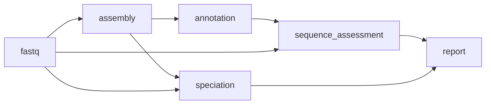

# assemble pipeline


This workflow will simply generate assemblies from paired-end fastq, run basic genome annotation with `prokka` and assess the quality of both the input reads and the resulting assemblies. This workflow forms the basis for amr, typing and pangenome analysis.



This pipeline should be used if you would like to generate _de novo_ assemblies from paired-end reads. You can choose from `spades`, `skesa`, `shovill + skesa` or `shovill + spades` (default)

```
bohra run assemble -i input_file.tsv -j my_assembly_pipeline -a shovill_skesa
```
where
- `-i/--input_file` is a tab-delimited file formatted as described [here](../usage/overview.md)
- `-j/--job_id` is the name of your run. This value will appear on your report.
- `-a/--assembler` is the assembler to use (ONT coming soon)
