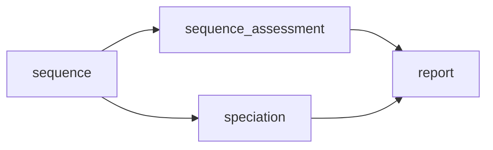

# basic pipeline

This workflow will run on fastq and/or fasta (depending user supplied input) and is the first step in all other workflows implmented by `bohra`. It can also be used alone as a simply quality control workflow.



```
bohra run basic -i input_file.tsv -j my_basic_pipeline
```
where
- `-i/--input_file` is a tab-delimited file formatted as described [here](../usage/overview.md)
- `-j/--job_id` is the name of your run. This value will appear on your report.
