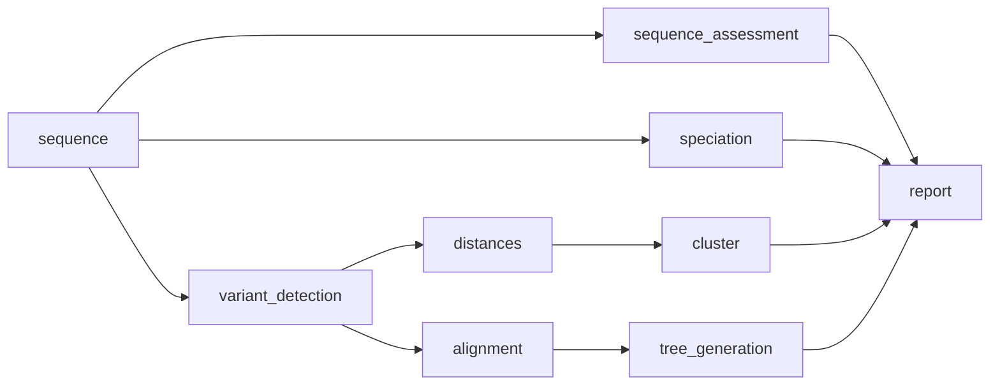

# comparative pipeline

This workflow undertakes a comparative anaysis of all the sequences included in the analysis. You can use reference based alignments with `snippy` or you can use reference free approaches with `mash` and `ska2`. 



 Please take note - it will not run any assembly based tools, like MLST or AMR. If these are required use the `full` pipeline. There are three tools available in `bohra` that can be used for this purpose
1. `snippy` (default) - a reference based approach, detecting SNPS compared to a reference genome. This option can ONLY take paired-end fastq files as input and requires the provision of a reference genome.
2. `ska2` - this is a reference free approach, inferring SNPS based on splits in kmers. You can use paired-end fastq and/or _de novo_ assemblies as input.
3. `mash` - this is a quick reference free approach which allows for approximation of genetic distances between sequences. Like `ska2` you can provide paired-end fastq and/or _de novo_ assemblies as input.

Further customisation includes selection of the data which is used to generate the tree (for `snippy` and `ska2`)

1. distances - you can generate a distance based tree, where the branch lengths are simply the SNP distances between sequences
2. alignment - this will generate a maximum liklihood phylogentic tree, using the GTR model of phylogenetic inference.

Additionally - you can select the tree builder to use. `VeryFastTree` is the default tree builder - as it is very quick. But if required you can also use `IQtree`.

1. `IQtree`
2. `VeryFastTree` (default)


For example

**snippy (alignment and iqtree) and cluster at a threshold of <= 5 and <= 25**
```
bohra run comparative -i input_file.tsv -j my_snippy_pipeline -ref <path_to_reference.fa(gbk)> --tree_builder iqtree --cluster_threshold 6,26
```
**ska2 (distance and veryfastree) and cluster at a threshold of <= 5 and <= 25, using complete linkage**
```
bohra run comparative -i input_file.tsv -j my_ska2_pipeline --comparative_tool ska2 --cluster_method complete --cluster_threshold 6,26
```
