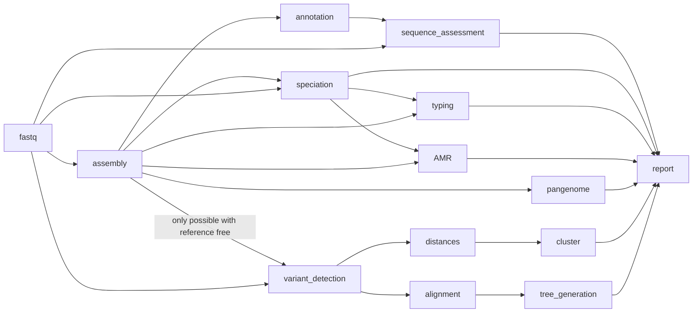

# full pipeline

The full workflow includes all the workflows outlined above with the addition of pangenome analysis using `panaroo`.




Like the `comparative` pipeline, you can select the comparative tool, tree builder, cluster methods, and thresholds. In addition, this pipeline will undertake the assembly, amr and typing described above and additional pangenome analysis.

For example

```
bohra run full -i input_file.tsv -j my_full_pipeline -ref <path_to_reference.fa(gbk)> --tree_builder iqtree --cluster_threshold 6,26
```
