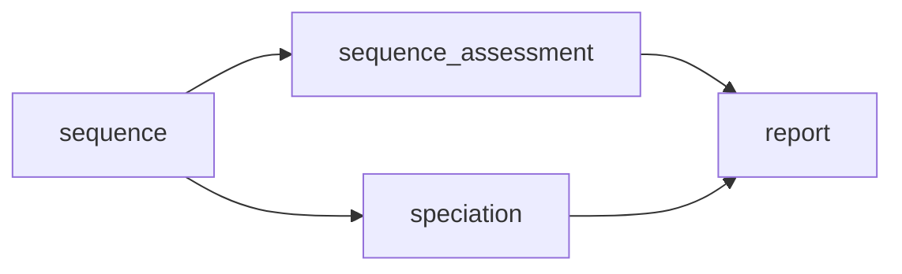
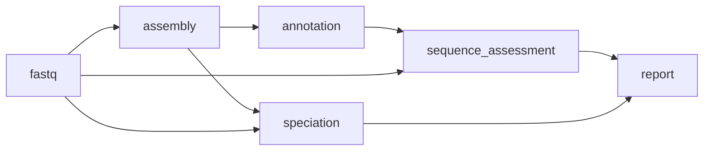
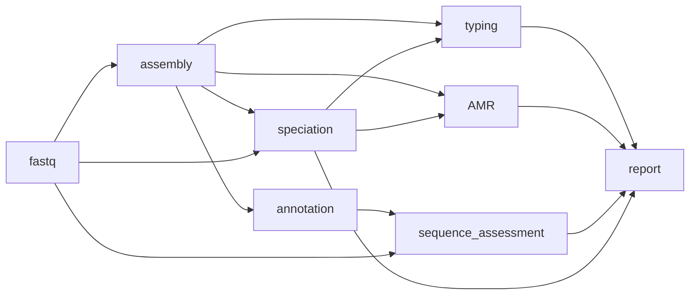
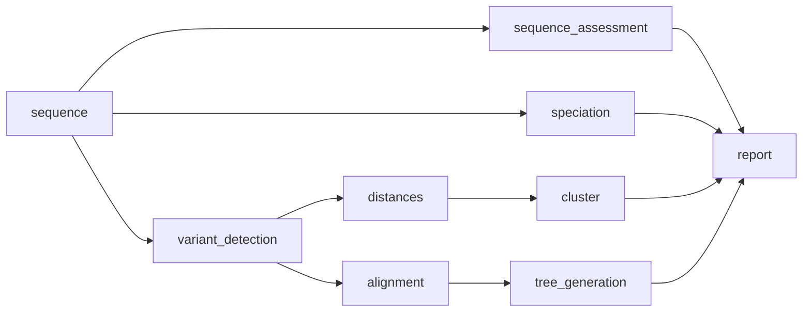
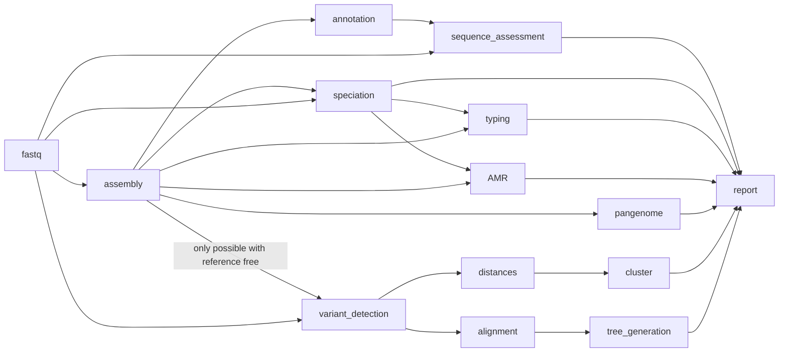
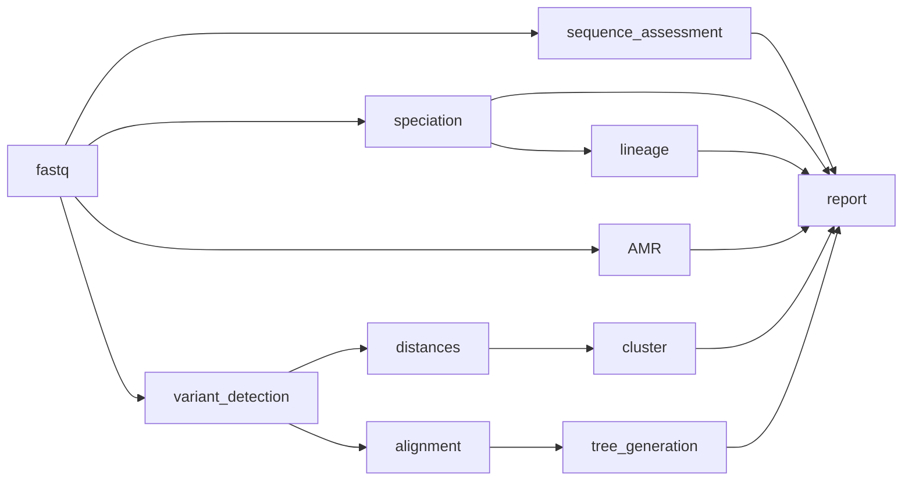

# Usage overview

Users have the option to supply paired-end fastq (support for ONT coming soon) and/or _de novo_ assemblies as inputs into the pipeline. 

- Paired-end fastq only - where you only have paired-end fastq `bohra` will generate _de novo_ assemblies if required.

- _de novo_ assemblies only - where you only have _de novo_ assemblies `bohra` will not use a reference-based approach for comparative analysis. However, reference-free comparative tools, `ska2` and `mash` are available.

- Both paired-end fastq and _de novo_ assemblies - in situations where you have _de novo_ assemblies already generate, you can supply both sequence types to `bohra`. It will use the supplied _de novo_ assemblies for any steps which require them, potentially saving you time.

Additionally, you can also supply the species value and any optional sample metadata that may be useful.

## Input file

`bohra` requires a single tab-delimited file as input, you can find examples [here] TO ADD.

| Column name | Description | Required? | 
| :---: | :---: | :---: | 
| Isolate | This is the name of the sequence or sample and will appear throughout `bohra` outputs. It must be unique.| Yes|
| r1 | The path to read 1 | If an assembly file is not supplied you must supply reads | 
| r2 | The path to read 2 | If an assembly file is not supplied you must supply reads |
| assembly | The path to the assembly for the isolate | If reads are not supplied you must supply an assembly file |
| species | The expected species of the sample or 'control'.  | No |

**Species column**

If you do not require speciation as part of the pipeline and already know the species, you can provide it here. Please note if no speciation is undertaken, `bohra` will use this value to undertake typing and AMR mechanisms/inferrence. If the species in this column is NOT accurate - unexpected results may occur. Furthermore if your analysis includes control sequences you can provide that information here (`control`) and the sequence will not be included in any comparative analysis.

**Annotation**

Where you are undertaking a comparative analysis (`snippy`, `ska2`, `mash`) you may also provide additional columns of relevant metadata in your input file. `bohra` will do data validation on these columns - that is up to the user. But any additional metadata provided will be visible on the tree provided in the report file.

**`bohra` can generate the input file for you**

If you have 

* A table with a list of isolates and othe data (species or other metadata) (column 'Isolate' must be included) 

AND/OR

* Paths to your reads and/or contigs

`bohra` can generate the input file for you. 

```
bohra generate-input --isolate_ids <table_name>.tsv --reads /path/to/reads --contigs /path/to/contigs
```
This will generate a file called `bohra_input.tsv` which you can use as input into `bohra`.

**Note that on large file systems this may take a while**


## Workflows

`bohra` is a flexible pipeline and allows users to customise the workflows used. Below is an overview of each workflow. More detail on tools and options for each workflow can be found [here](usage/running_bohra.md) and [here](usage/modules.md). Further explanations and detailed guides can be found [here](guides/overview.md)

**[basic](running_bohra#basic)**

This workflow will run on fastq and/or fasta (depending user supplied input) and is the first step in all other workflows implmented by `bohra`. It can also be used alone as a simply quality control workflow.


**assembly**

This workflow will simple generate assemblies from paired-end fastq, run basic genome annotation with `prokka` and assess the quality of both the input reads and the resulting assemblies. This workflow forms the basis for amr, typing and pangenome analysis.



**amr and typing**

This workflow will use user supplied species or the species detected in the sequence to determine the appropriate typing and AMR pipeline to use. Additional inferrence of genomic DST/AST will be undertaken for _S. enterica_ and _M. tuberculosis_.

If assembly is required and fastq are used as input - the assembly workflow will be triggered. 

Note that for AMR and gDST in _M. tuberculosis_ paired-end fastq are required. We recommend to use the `bohra run tb` workflow for _M. tuberculosis_.



**comparative analysis**

This workflow undertakes a comparative anaysis of all the sequences included in the analysis. You can use reference based alignments with `snippy` or you can use reference free approaches with `mash` and `ska2`. 



**full**

The full workflow includes all the workflows outlined above with the addition of pangenome analysis using `panaroo`.



**tb**

`bohra` now has a _M. tuberulosis_ specific workflow, which does not run MLST or other assembly based tools. And undertakes _M. tuberculosis_ relevant gDST. It uses the H37rV reference genome, masking repetitive sites and `tbtAMR` for generation of an inferred antibiogram.



## A note on databases

Many bioinformatics tools require the use of a database or data collection. Where possible and appropriate, `bohra` utilises the databases that come packaged with the tools being used in order to ensure expected behaviour and consistency. However, there are cases were the user will need to supply a database path. 

* `kraken2` - these databases are very large and not easily packaged for distribution with software. So the user will either need to have existing databases available or download them as part of the setup of `bohra`. This information is [here](../installation.md)

* `mlst` comes packaged with a collection of profiles and is ready to use. However, due to changes in licensing, the most up to date profiles cannot be included. As such if you have available to you a current mlst database that is configured for use with `mlst` you can set the `BOHRA_PUBMLST_DB` and `BOHRA_BLAST_DB` environment variables as part of the setup of `bohra`, as described [here](../installation.md)