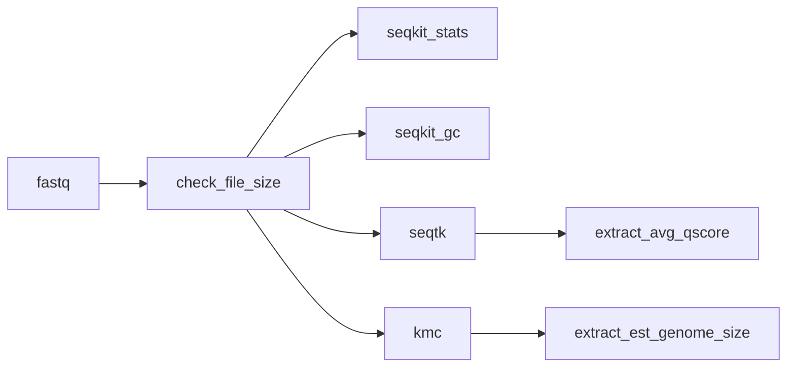

# Running `bohra`

`bohra` has 6 pipelines to choose from

1. `basic`
2. `assemble`
3. `amr_typing`
4. `comparative`
5. `full`
6. `tb`

## basic

This pipeline is a basic sequence assessment pipeline. It can be run as a standalone to assess your sequence data, but is also run as part of all other pipelines.

**Workflow**

