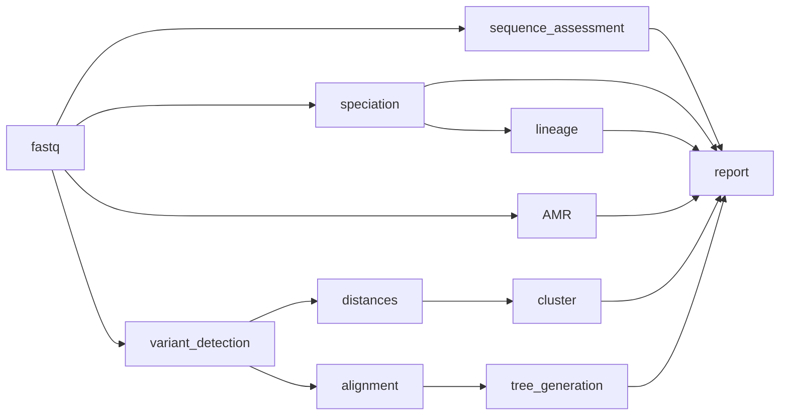

# tb pipeline

`bohra` now has a _M. tuberulosis_ specific workflow, which does not run MLST or other assembly based tools. And undertakes _M. tuberculosis_ relevant gDST. It uses the H37rV reference genome, masking repetitive sites and `tbtAMR` for generation of an inferred antibiogram.


The `tb` pipeline will run tools specific for _M. tuberculosis_, using `tbtAMR` (WHO v2 catalogue) for inferrence of resistance and the H37rV reference genome and mask

```
bohra tb -i input_file.tsv -j my_tb_pipeline
```